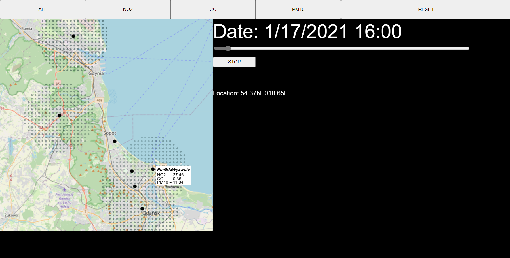
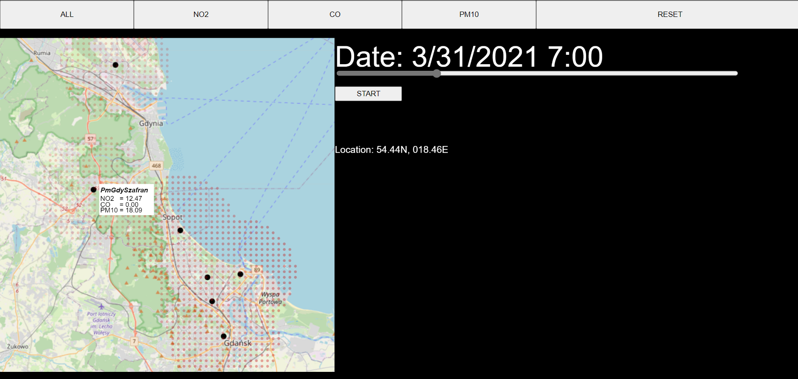

# Smart City - Zadanie eliminacyjne


## Uruchomienie programu

Program został napisany w JavaScript przy użyciu p5.js. <br />
Aby go uruchomić należy odpalić lokalny serwer http np. w Vs Code z zainstalowanym dodatkiem **Live Server**<br />
Również można to zrobić będąc o dopowiednim folderze w Pythonie używając komendy:


```python
python -m SimpleHTTPServer
```
## Przykładowe zdjęcia programu

<br />
<br />

